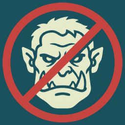

# Deorcify

    

**Deorcify** is a package that can be added to any .NET application or library to prevent it from running in Russia and Belarus.

## Install

- 📦 [NuGet](https://nuget.org/packages/Deorcify): `dotnet add package Deorcify`

> [!TIP]
> You can use [**Binternal**](https://github.com/Tyrrrz/Binternal) to internalize this library if you prefer to avoid taking an external dependency.
